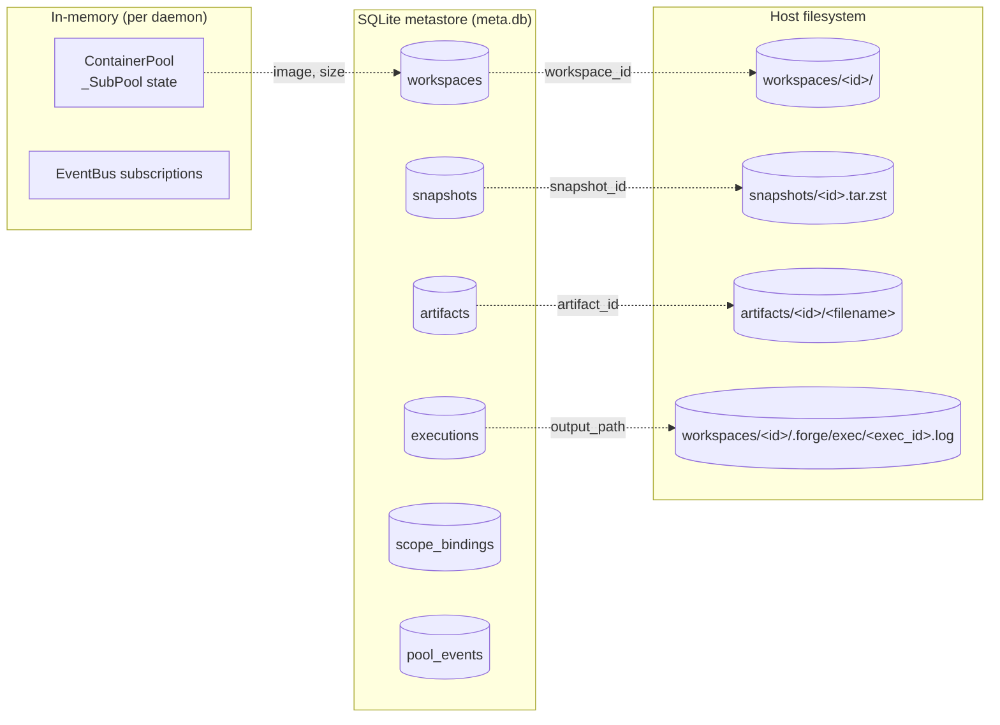
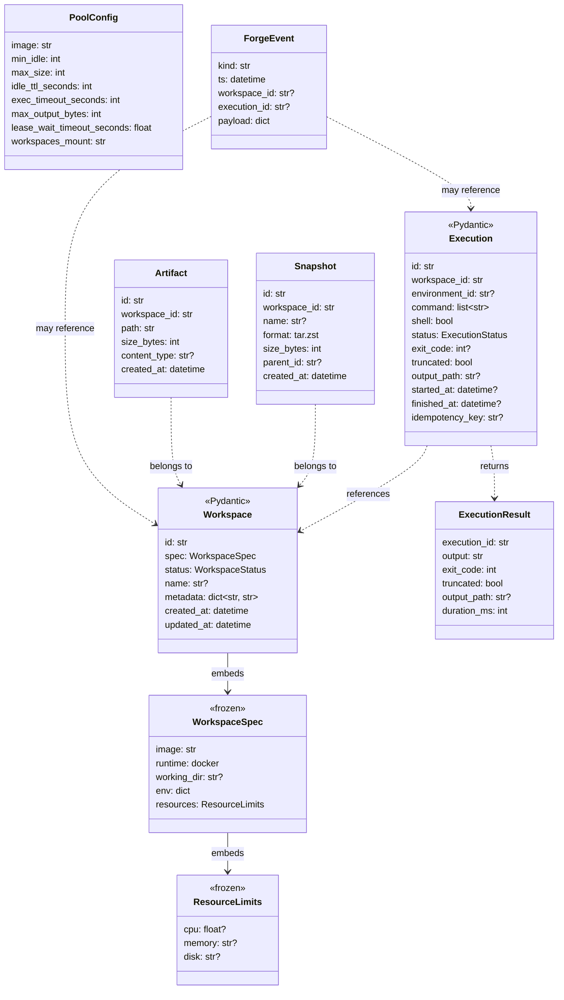
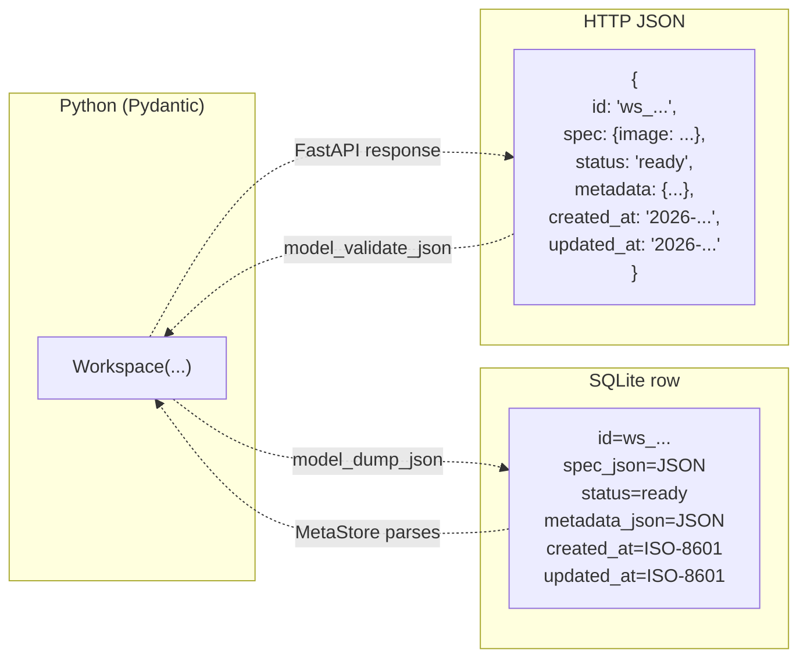

# Data model and storage

**Everything Forge knows about the world lives in three places:** the SQLite metastore, the workspace tree on disk, and the pool's in-memory state. This doc maps every domain object to where it's stored, how it's serialized, and what invariants hold across the boundary.

---

## Overview



**Reading the diagram:** every metadata row in the metastore has a matching artifact on disk (a directory, an archive, or a file). The pool holds only ephemeral state — no persistence beyond `pool_events` audit entries.

---

## Where each entity is defined

| Type | Definition | Persistence | Notes |
|---|---|---|---|
| `Workspace` | [`forge.models.Workspace`](../../src/forge/models.py) | `workspaces` table + `<data_root>/workspaces/<id>/` directory | Row + directory created atomically; rollback on failure |
| `WorkspaceSpec` | [`forge.models.WorkspaceSpec`](../../src/forge/models.py) | Embedded in `workspaces.spec_json` | Frozen; changes only via new workspace |
| `ResourceLimits` | [`forge.models.ResourceLimits`](../../src/forge/models.py) | Embedded in `WorkspaceSpec` | CPU cores + memory string ("1Gi") |
| `Execution` | [`forge.models.Execution`](../../src/forge/models.py) | `executions` table (+ optional overflow log on disk) | Idempotency key uniqueness enforced |
| `ExecutionResult` | [`forge.models.ExecutionResult`](../../src/forge/models.py) | Not persisted; derived from `Execution` + captured output | Return type only |
| `Environment` | [`forge.models.Environment`](../../src/forge/models.py) | Not persisted; pool-owned in memory | ID stored in `executions.environment_id` for tracing |
| `Snapshot` | [`forge.models.Snapshot`](../../src/forge/models.py) | `snapshots` table + `<data_root>/snapshots/<id>.tar.zst` | tar streamed through zstandard |
| `Artifact` | [`forge.models.Artifact`](../../src/forge/models.py) | `artifacts` table + `<data_root>/artifacts/<id>/<filename>` | Original filename preserved |
| `PoolConfig` | [`forge.models.PoolConfig`](../../src/forge/models.py) | Config-only (not persisted) | Set at daemon start / via `ForgeConfig` |
| `PoolStats` | [`forge.models.PoolStats`](../../src/forge/models.py) | Not persisted; derived from `_SubPool` counters | Snapshot for `/pool/status` |
| `RuntimeCapabilities` | [`forge.models.RuntimeCapabilities`](../../src/forge/models.py) | Not persisted; queried from `driver.capabilities()` | Used for capability dispatch |
| `ForgeEvent` | [`forge.models.ForgeEvent`](../../src/forge/models.py) | `pool_events` optional; ephemeral in `EventBus` | Not durable in MVP |
| `LogEvent` | [`forge.models.LogEvent`](../../src/forge/models.py) | Not persisted; streamed | One `LogEvent` per stdout/stderr chunk |
| Request models (`CreateWorkspaceRequest`, `ExecRequest`, `FileWriteRequest`, `FileEditRequest`, `SnapshotCreateRequest`, ...) | [`forge.models`](../../src/forge/models.py) | Wire-only; validated at HTTP boundary | Pydantic |

---

## Detailed model relationships



---

## Metastore schema

Full DDL lives at [src/forge/storage/migrations.py](../../src/forge/storage/migrations.py). Below is the annotated version:

```sql
-- Workspaces: the primary noun
CREATE TABLE IF NOT EXISTS workspaces (
    id            TEXT PRIMARY KEY,        -- "ws_<uuid>"
    spec_json     TEXT NOT NULL,           -- JSON-serialized WorkspaceSpec
    status        TEXT NOT NULL,           -- "creating" | "ready" | "deleting" | "deleted" | "failed"
    name          TEXT,                    -- human-readable, optional
    metadata_json TEXT NOT NULL,           -- {"scope": "thread", "thread_id": "..."}
    created_at    TEXT NOT NULL,           -- ISO-8601 UTC
    updated_at    TEXT NOT NULL
);
CREATE INDEX IF NOT EXISTS workspaces_status ON workspaces(status);

-- Executions: history of every command run in every workspace
CREATE TABLE IF NOT EXISTS executions (
    id                TEXT PRIMARY KEY,    -- "ex_<uuid>"
    workspace_id      TEXT NOT NULL,
    environment_id    TEXT,                -- transient; container/microVM id at exec time
    command_json      TEXT NOT NULL,       -- JSON list[str]
    shell             INTEGER NOT NULL,    -- 0/1
    status            TEXT NOT NULL,       -- queued|running|succeeded|failed|timed_out|cancelled
    exit_code         INTEGER,
    truncated         INTEGER NOT NULL DEFAULT 0,
    output_path       TEXT,                -- ".forge/exec/<id>.log" if overflow spilled
    started_at        TEXT,
    finished_at       TEXT,
    idempotency_key   TEXT,
    FOREIGN KEY (workspace_id) REFERENCES workspaces(id) ON DELETE CASCADE
);
CREATE UNIQUE INDEX IF NOT EXISTS executions_idempotency
    ON executions(workspace_id, idempotency_key)
    WHERE idempotency_key IS NOT NULL;
CREATE INDEX IF NOT EXISTS executions_ws_started ON executions(workspace_id, started_at);

-- Snapshots: tar.zst archives of workspaces
CREATE TABLE IF NOT EXISTS snapshots (
    id           TEXT PRIMARY KEY,          -- "snap_<uuid>"
    workspace_id TEXT NOT NULL,
    name         TEXT,
    format       TEXT NOT NULL,             -- "tar.zst"
    size_bytes   INTEGER NOT NULL,
    parent_id    TEXT,                      -- future: incremental parent
    created_at   TEXT NOT NULL,
    FOREIGN KEY (workspace_id) REFERENCES workspaces(id) ON DELETE SET NULL,
    FOREIGN KEY (parent_id)    REFERENCES snapshots(id)  ON DELETE SET NULL
);
CREATE INDEX IF NOT EXISTS snapshots_ws ON snapshots(workspace_id);

-- Artifacts: exported files, one per row
CREATE TABLE IF NOT EXISTS artifacts (
    id            TEXT PRIMARY KEY,         -- "art_<uuid>"
    workspace_id  TEXT NOT NULL,
    path          TEXT NOT NULL,            -- workspace-relative source path
    size_bytes    INTEGER NOT NULL,
    content_type  TEXT,
    created_at    TEXT NOT NULL,
    FOREIGN KEY (workspace_id) REFERENCES workspaces(id) ON DELETE SET NULL
);
CREATE INDEX IF NOT EXISTS artifacts_ws ON artifacts(workspace_id);

-- Scope bindings: LangChain thread/assistant → workspace
CREATE TABLE IF NOT EXISTS scope_bindings (
    scope_kind    TEXT NOT NULL,            -- "thread" | "assistant" | "user_thread"
    scope_key     TEXT NOT NULL,
    workspace_id  TEXT NOT NULL,
    created_at    TEXT NOT NULL,
    PRIMARY KEY (scope_kind, scope_key),
    FOREIGN KEY (workspace_id) REFERENCES workspaces(id) ON DELETE CASCADE
);

-- Pool events: audit trail of significant pool actions
CREATE TABLE IF NOT EXISTS pool_events (
    id           INTEGER PRIMARY KEY AUTOINCREMENT,
    ts           TEXT NOT NULL,
    image        TEXT,
    kind         TEXT NOT NULL,             -- "warm_start", "reap", "health_kill", ...
    payload_json TEXT NOT NULL
);
CREATE INDEX IF NOT EXISTS pool_events_ts ON pool_events(ts);
```

**Migrations are idempotent** (`CREATE TABLE IF NOT EXISTS`). No versioning; no alembic. A migration to add a column is a code change in `migrations.py` plus one `ALTER TABLE ADD COLUMN` guarded by a probe. This is fine for MVP; V2 with Postgres will probably want proper migration tooling.

---

## On-disk layout in detail

```
/var/lib/forge/                          ← ForgeConfig.data_root
│
├── meta.db                              ← SQLite (WAL mode, one file)
│   ├── meta.db-wal                      ← write-ahead log
│   └── meta.db-shm                      ← shared memory
│
├── workspaces/                          ← WorkspaceStore.root
│   │                                    ← bind-mounted RW at /workspaces
│   │                                    ← in every pooled container
│   │
│   ├── ws_abc123.../                    ← one dir per workspace
│   │   │
│   │   ├── main.py                      ← agent-created files live here
│   │   ├── src/lib/util.py              ← ...and here
│   │   ├── data/
│   │   │
│   │   └── .forge/                      ← reserved; filtered from ls
│   │       └── exec/
│   │           ├── ex_....log           ← overflow log for one exec
│   │           └── ex_....log
│   │
│   └── ws_def456.../
│
├── snapshots/                           ← SnapshotStore.root
│   ├── snap_....tar.zst                 ← one archive per snapshot
│   └── snap_....tar.zst
│
└── artifacts/                           ← ArtifactStore.root
    ├── art_a1b2.../
    │   └── report.pdf                   ← original filename preserved
    └── art_d4e5.../
        └── screenshot.png
```

**Path safety enforced in code:**

- [`FilesService._resolve()`](../../src/forge/services/files_service.py) — every user-supplied path goes through `resolve()` + `is_relative_to(root)`. Absolute paths, `..`, and out-of-workspace symlinks are rejected.
- `.forge/` is refused for both read and write by user API.
- `WorkspaceStore._validate_workspace_id()` — refuses IDs with slashes or `..`.

---

## Serialization at boundaries

Same models flow through three boundaries, serialized appropriately at each:



Two rules keep this consistent:

1. **Pydantic is the source of truth.** Every model has `model_dump_json()` / `model_validate_json()`. HTTP layer, metastore, and cross-process events all use these.
2. **Datetimes are always tz-aware, ISO-8601.** Stored as TEXT in SQLite (preserves the `Z` or `+00:00` suffix). Deserialized back into `datetime` with `tzinfo` intact. Never store naïve datetimes.

The metastore does the JSON encode/decode in [`storage/meta_store.py` `_row_to_workspace`](../../src/forge/storage/meta_store.py).

---

## The Execution row lifecycle

Every command an agent runs creates an `executions` row and mutates it as it progresses:

```mermaid
sequenceDiagram
    autonumber
    participant Svc as ExecutionService
    participant Meta as executions table
    participant FS as workspace .forge/exec/

    Svc->>Meta: INSERT status=queued, idempotency_key
    Note over Meta: row visible; retries here return cached

    Svc->>Meta: UPDATE status=running, started_at=NOW
    Note over Svc: pool session acquired, exec running

    alt Successful exec
        Svc->>Meta: UPDATE status=succeeded, exit_code=0, finished_at
    else Non-zero exit
        Svc->>Meta: UPDATE status=failed, exit_code=N, finished_at
    else Timeout
        Svc->>Meta: UPDATE status=timed_out, exit_code=124, finished_at
    end

    opt Oversized output
        Svc->>FS: write .forge/exec/&lt;exec_id&gt;.log
        Svc->>Meta: UPDATE truncated=1, output_path=.forge/exec/&lt;exec_id&gt;.log
    end
```

**Idempotency semantics:** the `(workspace_id, idempotency_key)` UNIQUE constraint guarantees that a second identical request returns the cached execution row instead of running the command again. The check happens before we lease a container — see [`ExecutionService.exec()`](../../src/forge/services/execution_service.py).

**Overflow spill:** the driver-level buffer never exceeds `max_output_bytes`. If it fills, `truncated=True` is set on the result, and the *captured* portion is written to `.forge/exec/<exec_id>.log` inside the workspace. Anything past the buffer cap is dropped (the driver reads and discards remaining output to let the container exit cleanly). If you need the *entire* command output regardless of size, redirect to a file yourself inside the command.

---

## Trust boundaries in the data model

Two boundaries you should be aware of when integrating:

### 1. Metadata is trusted

`Workspace.metadata` is a plain `dict[str, str]` set by the caller at create time. Forge doesn't validate its contents beyond typing — anything from tenant identifiers to feature flags can live here. **If you're building tenant scoping on top of Forge, put the tenant ID in metadata**, and enforce access checks in your own middleware. The daemon does not enforce them today.

### 2. The workspaces tree is shared inside containers

All workspace directories are mounted at `/workspaces` inside every pooled container. The `FilesService` prevents an agent from *asking* Forge to read `../other_ws`, but shell code inside the container can `ls /workspaces` and see peer workspaces directly. This is the single biggest reason to wait for V2 Firecracker before running untrusted-agent workloads.

Path safety recap:
- `FilesService.write("path")` → resolved against workspace root, `../` refused.
- `FilesService.read("path")` → same.
- `FilesService.grep("...", path_glob="...")` → glob is applied *after* resolving; no escape.
- `agent.exec("cat /workspaces/other/*.env")` → **not** blocked. This is the tenancy caveat.

---

## Schema evolution notes

For contributors adding fields:

1. **New optional column** → add to model with a default; add `ALTER TABLE ADD COLUMN` in `migrations.py` guarded by a `PRAGMA table_info` probe; unit tests for the new field.
2. **New required column** → considered breaking. Bump the "schema version" (informally — no version table exists yet) and add a data migration.
3. **New table** → append `CREATE TABLE IF NOT EXISTS` to `migrations.py`; add CRUD methods to `MetaStore`; unit tests hitting a tmpdir DB.
4. **Renaming a field** → don't. Add a new field, deprecate the old one, dual-write for a release, then drop.

The Pydantic models are the API contract — think of them as public and version them the way you'd version an API schema.

---

## Related reading

- [overview.md](overview.md) — the top-level architecture doc, section "What lives in the metastore" for the ER view.
- [pool-and-runtime-session.md](pool-and-runtime-session.md) — pool internals and how it interacts with executions.
- [../mvp-design.md](../mvp-design.md) — original MVP core types.
- [../v2/plan.md](../v2/plan.md) — what changes for Postgres + object-storage in V2.
