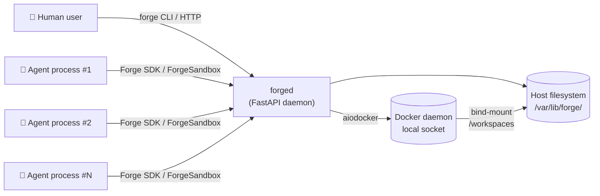
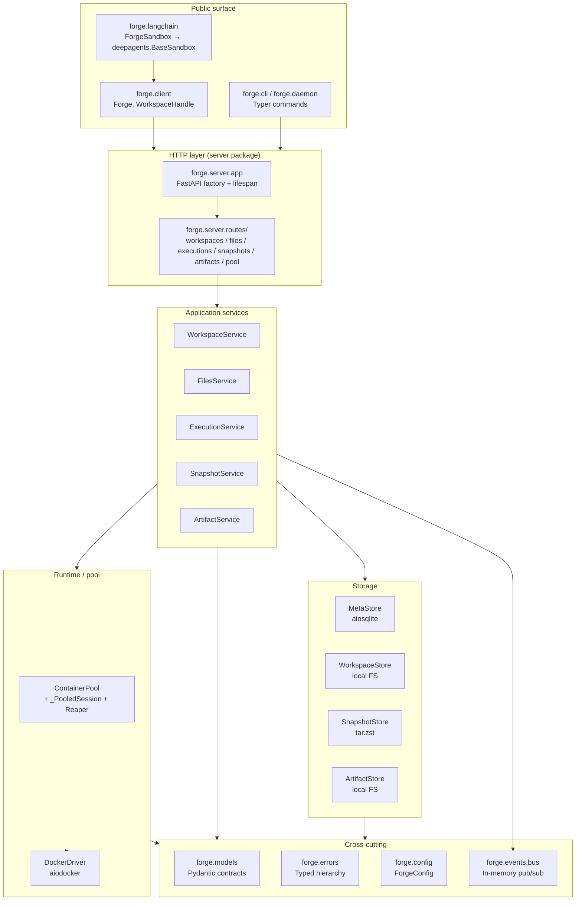
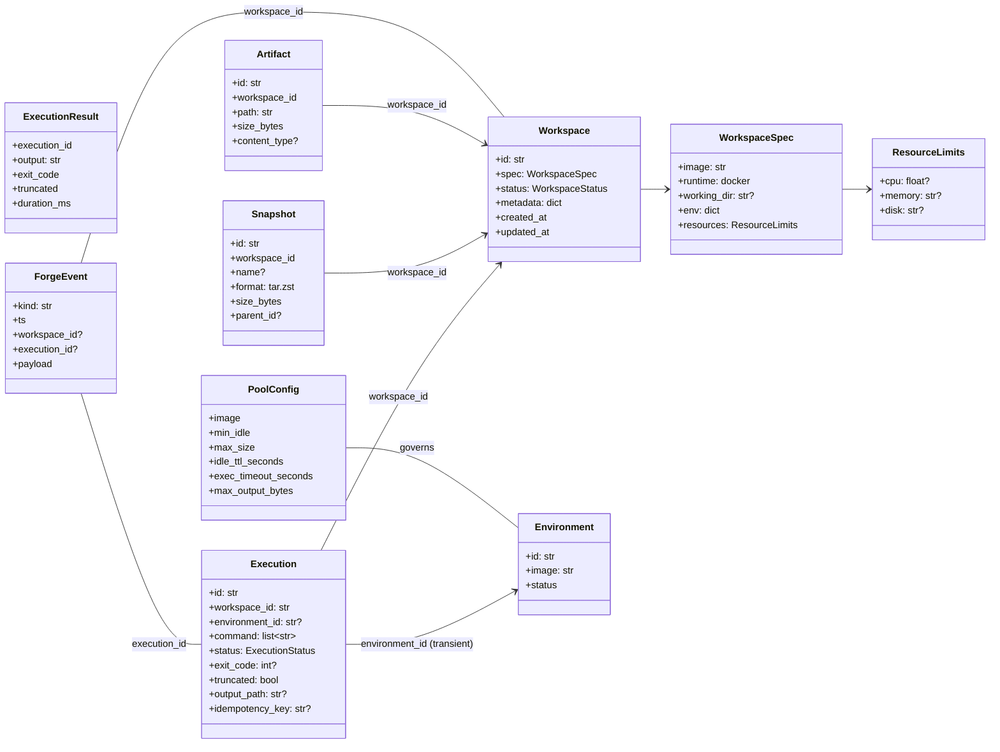
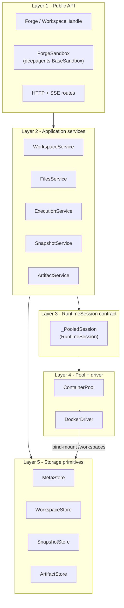
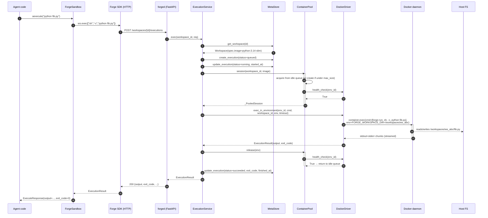
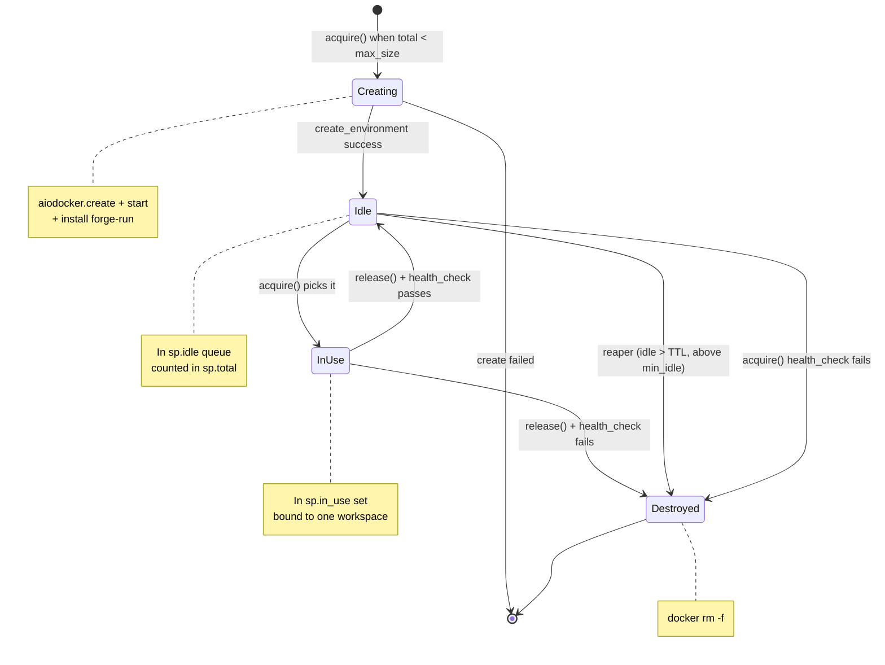
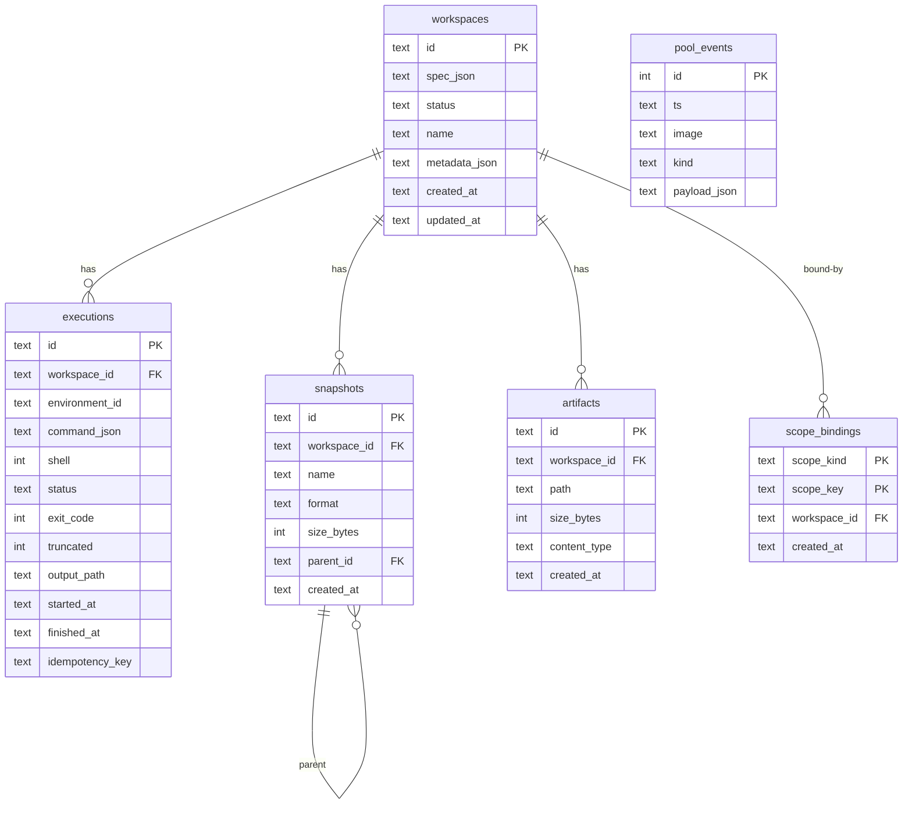
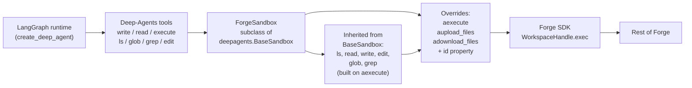

# Forge — architecture overview

**A visual, end-to-end walkthrough of how Forge is put together today.** If you've only skimmed [../mvp-design.md](../mvp-design.md) and [../mvp-implementation-notes.md](../mvp-implementation-notes.md), this document ties the pieces together with diagrams.

**Audience:** contributors + integrators. If you just want to run agents, [../../README.md](../../README.md) is faster.

---

## The one-paragraph mental model

Forge is a **daemon that lends warm Docker containers to short-lived agent commands, while keeping each agent's files in its own persistent host directory**. Think "database connection pool, but for exec environments". A pool of, say, 4 warm containers can serve 20 concurrent agents because agents spend ~90% of their time thinking (LLM calls), only ~10% executing. Every command runs with `cwd=/workspace`, but under the hood that path resolves to a different host directory per session — driven by a tiny `forge-run` entrypoint helper installed into every pooled container.

Everything else — snapshots, artifacts, LangChain/Deep-Agents adapter, HTTP API, Python SDK, CLI — is layered on top of that core.

---

## System context



**Two things worth calling out:**

1. **Many agent processes share one `forged`.** That's the whole point. If every agent embedded its own pool, you'd pay N× the RAM baseline.
2. **The Docker daemon and Forge daemon share the host filesystem.** The pooled containers bind-mount `/var/lib/forge/workspaces` read-write, and Forge writes into the same tree from outside the containers. Zero copying between "workspace on host" and "workspace visible to agent".

---

## Package layout



Everything above the "Storage" and "Runtime" bands only talks through interfaces defined in the "Cross-cutting" band (`models`, `errors`, `config`). That's what makes S3 / Postgres / Firecracker swaps ~1-file changes later.

**Files if you want to read the code in this order:**

1. [src/forge/models.py](../../src/forge/models.py) — every domain object.
2. [src/forge/config.py](../../src/forge/config.py) — the config knobs.
3. [src/forge/drivers/base.py](../../src/forge/drivers/base.py) — the `RuntimeDriver` / `RuntimeSession` contract (this is the load-bearing abstraction).
4. [src/forge/pool/container_pool.py](../../src/forge/pool/container_pool.py) — the "shared resource" heart of the project.
5. [src/forge/services/execution_service.py](../../src/forge/services/execution_service.py) — where an exec request becomes real work.
6. [src/forge/langchain/sandbox.py](../../src/forge/langchain/sandbox.py) — the Deep-Agents integration.

---

## Domain model



**Key subtlety:** an `Environment` (a running container) is pool-owned. A workspace **does not own an environment** — it borrows one for the duration of an execution burst. That's the difference between Forge and "one container per workspace" systems.

Definitions live in [src/forge/models.py](../../src/forge/models.py); every model is Pydantic v2 so serialization to HTTP / metastore is free.

---

## Runtime layers and their contracts



**Layer 3 is the load-bearing wall.** Everything above it (services, SDK, LangChain) is coupled only to `RuntimeSession` — a workspace-scoped exec channel. Everything below it is coupled to `RuntimeDriver` — a raw driver API. Swap the driver (Docker → Firecracker → K8s) and Layer 3 shields Layers 1-2 from the change.

See [../mvp-implementation-notes.md](../mvp-implementation-notes.md#a1--runtime-is-session-oriented-not-container-oriented) for the full amendment.

---

## The critical path: one `execute()` call

The most useful diagram in this whole doc. Traces a single agent tool call from top to bottom:



**Look at steps 12-14.** The `docker exec` runs `forge-run` which reads `FORGE_WORKSPACE_DIR` from its env, `cd`s into it, and only *then* runs the user's command. That's the whole trick: one container serves many workspaces because the *only* thing that changes between execs is an env variable — no remounting, no restarting.

Contrast with the naive "one container per workspace" approach: every new agent pays the container-start cost (~200-500ms) and holds a container's worth of RAM idle for the whole session.

---

## The pool state machine

Each `_SubPool` (one per image) manages containers through this lifecycle:



Sub-pool invariants (guarded by `sp.lock`):

- `sp.total = len(sp.idle) + len(sp.in_use)` — always.
- `sp.total ≤ sp.config.max_size` — always.
- `sp.idle_count + sp.in_use_count ≥ sp.config.min_idle` — eventually (reaper re-warms).
- Health check runs **before hand-off** on acquire and **after release** — a dead container never sees a second exec.

The pool acquire logic is in [src/forge/pool/container_pool.py](../../src/forge/pool/container_pool.py) — the load-bearing method is `_acquire()` and it holds the sub-pool lock across `create_environment` (~200 ms of Docker) intentionally, to prevent the race where two concurrent acquires both see room and blow past `max_size`. That was actually one of the bugs found during implementation, fixed in the `feat/05-pool` branch.

---

## `forge-run`: the cwd trick

The single most useful implementation detail. Installed once per container at `/usr/local/bin/forge-run`:

```sh
#!/bin/sh
set -e
if [ -z "${FORGE_WORKSPACE_DIR:-}" ]; then
    echo "forge-run: FORGE_WORKSPACE_DIR unset" >&2
    exit 64
fi
ln -sfn "$FORGE_WORKSPACE_DIR" /workspace 2>/dev/null || true
cd /workspace
exec "$@"
```

Every `docker exec` invocation wraps the user's command with `forge-run`:

```
docker exec -e FORGE_WORKSPACE_DIR=/workspaces/ws_abc \
    <container>  forge-run  sh -c "python fib.py"
```

Result: user code sees `cwd=/workspace` regardless of which workspace it's actually working with. Ports directly to any future runtime — Firecracker just needs its guest to have a similar entrypoint.

Details in [src/forge/drivers/docker_driver.py](../../src/forge/drivers/docker_driver.py#L41).

---

## Persistence and on-disk layout

```
/var/lib/forge/                        (or wherever ForgeConfig.data_root points)
├── meta.db                            SQLite: workspaces, executions,
│                                      snapshots, artifacts, scope_bindings,
│                                      pool_events
├── workspaces/
│   ├── ws_abc123/                     one directory per workspace
│   │   ├── main.py                    user files
│   │   ├── src/
│   │   └── .forge/                    reserved metadata dir (invisible to ls)
│   │       └── exec/
│   │           └── ex_....log         oversized exec output spilled here
│   └── ws_def456/
├── snapshots/
│   ├── snap_....tar.zst               each snapshot = one archive
│   └── snap_....tar.zst
└── artifacts/
    ├── art_.../report.pdf             one directory per artifact,
    └── art_.../screenshot.png         original filename preserved
```

**Trust boundary reminder:** the whole `workspaces/` tree is bind-mounted at `/workspaces` inside every pooled container. Path safety in [src/forge/services/files_service.py](../../src/forge/services/files_service.py) prevents accidents from within Forge's own file API, but an agent that runs `ls /workspaces` sees all peer workspaces. That's the MVP's tenancy caveat — V2 Firecracker fixes it by mounting only the one workspace.

---

## What lives in the metastore



`(workspace_id, idempotency_key)` on `executions` has a UNIQUE constraint — that's what makes agent retries safe. Schema and migrations in [src/forge/storage/meta_store.py](../../src/forge/storage/meta_store.py) and [src/forge/storage/migrations.py](../../src/forge/storage/migrations.py).

---

## Deep-Agents integration in one picture



Because we subclass `deepagents.backends.sandbox.BaseSandbox`, the six file operations (`ls` / `read` / `write` / `edit` / `glob` / `grep`) are all inherited — they route through `aexecute` under the hood, which we implement natively async against Forge. That's why the adapter is ~200 lines: only `aexecute`, `aupload_files`, `adownload_files`, and `id` are ours.

Details in [src/forge/langchain/sandbox.py](../../src/forge/langchain/sandbox.py); demo notebook at [../../examples/notebooks/deep_agents_quickstart.ipynb](../../examples/notebooks/deep_agents_quickstart.ipynb).

---

## Concurrency and data-flow subtleties

1. **The pool holds `sp.lock` across `create_environment`.** That's ~200 ms of `docker run` blocking new acquires for the same image. Intentional — the alternative (drop the lock during creation) allows the "count = 4 but two acquires both see total < max_size and both create" race.
2. **The idempotency check reads from the metastore before spending any pool time.** A retried idempotent exec never leases a container.
3. **Oversized output** is truncated at the driver, then the service spills the captured chunk to `.forge/exec/<id>.log`. Buffer never grows past `max_output_bytes` in memory.
4. **The event bus is in-process only.** SSE at the HTTP layer bridges it out to consumers. Cross-process events (needed for multi-daemon deploys) is V2 work.
5. **`forge-run`'s symlink refresh is per-exec, not per-container.** So a container can serve workspace A one moment and workspace B the next.
6. **Docker's bind mount uses default propagation.** Loopback-quota schemes (per-workspace disk caps, future work) need `shared` or `rshared` propagation to see host-side mounts appear inside containers.

---

## Test coverage map

| Layer | Where | Test kind | Count |
|---|---|---|---|
| Models + errors | tests/unit/test_scaffold.py | Unit | 11 |
| Metastore | tests/unit/test_meta_store.py | Unit | 19 |
| Workspace store | tests/unit/test_workspace_store.py | Unit | 5 |
| Files service | tests/unit/test_files_service.py | Unit | 22 |
| Workspace service | tests/unit/test_workspace_service.py | Unit | 4 |
| Snapshots + artifacts | tests/unit/test_snapshots_and_artifacts.py | Unit | 20 |
| Docker driver | tests/integration/test_docker_driver.py | Integration | 12 |
| Container pool | tests/integration/test_pool.py | Integration | 7 |
| Execution service | tests/integration/test_execution_service.py | Integration | 8 |
| HTTP end-to-end | tests/integration/test_http.py | Integration | 12 |
| SDK + Deep-Agents | tests/integration/test_sdk_and_langchain.py | Integration | 7 |
| **Total** | | | **127** |

Integration tests require Docker; skip cleanly on hosts without it.

---

## Why the architecture is this way (one paragraph per decision)

- **Pool of containers, not one per workspace.** Agents are I/O-bound (LLM latency dominates); execution is bursty. Sharing containers by workspace-id inside `docker exec` amortizes both RAM and cold-start.
- **`RuntimeSession` as the sole cross-layer contract.** Discovered the hard way during MVP prep (see amendment A1) — coupling services directly to "container ID" would make V2 Firecracker a much bigger rewrite.
- **SQLite for the metastore.** Zero ops overhead for single-daemon deploys; upgrades to Postgres cleanly via the same interface. Multi-daemon is V2.
- **Pydantic models everywhere the HTTP boundary is crossed, dataclasses on internal hot paths.** Serialization for free where it's needed, no overhead where it isn't.
- **HTTP + SSE, not gRPC.** Every language has an HTTP client; agents don't need micro-second latency; keeps the ops story trivial.
- **`ForgeSandbox` subclasses `deepagents.BaseSandbox` directly.** Free inheritance of the file-op family; no adapter drift when Deep-Agents adds new methods.
- **Snapshots as `tar.zst` archives.** Simplest thing that works; incremental / content-addressed is V2 territory.

---

## Related docs

- [pool-and-runtime-session.md](pool-and-runtime-session.md) — deeper dive into the pool + session mechanics.
- [data-model.md](data-model.md) — every model and where it's persisted.
- [../mvp-design.md](../mvp-design.md) — the original MVP scope + shape.
- [../mvp-implementation-notes.md](../mvp-implementation-notes.md) — design amendments captured during implementation.
- [../low-level-design.md](../low-level-design.md) — the Deep-Agents mapping table.
- [../v2/plan.md](../v2/plan.md) — the V2 plan informed by SDK research.
- [../v2-design.md](../v2-design.md), [../v3-design.md](../v3-design.md) — original direction-of-travel documents.
