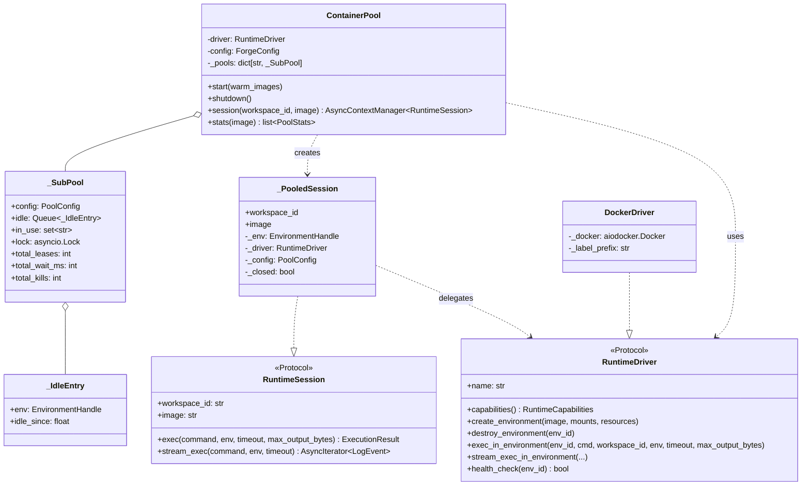
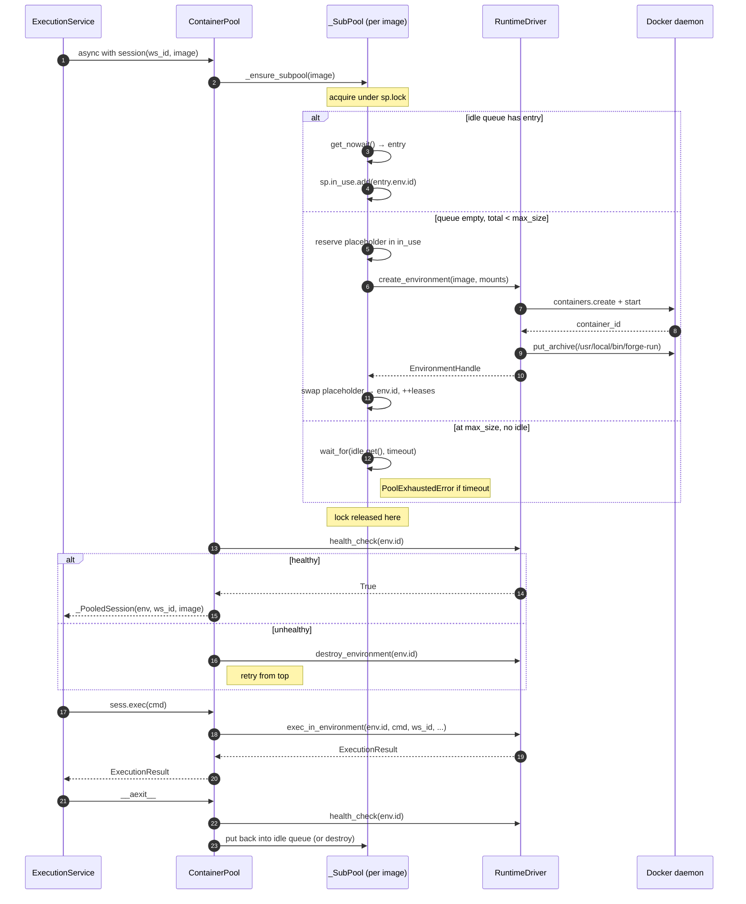
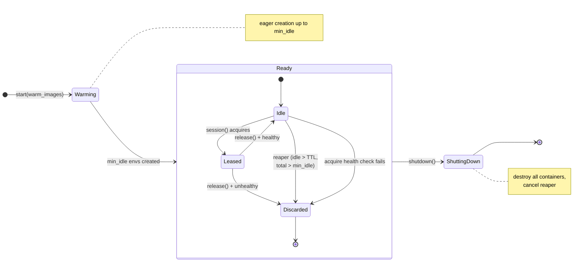
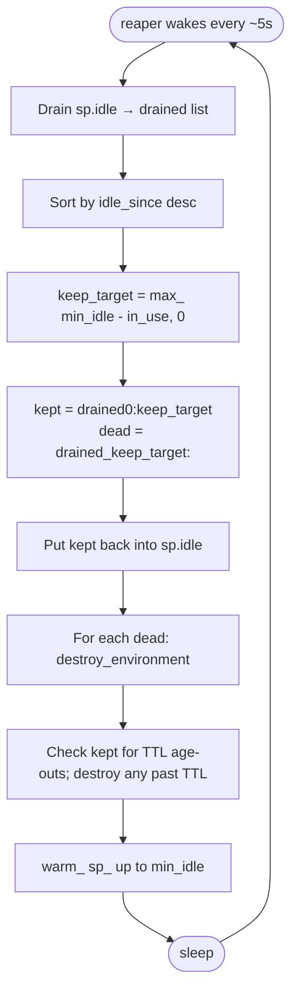

# The container pool and `RuntimeSession` contract

**Why Forge exists as a distinct project reduces to one design choice: the pool.** This doc walks through the mechanics — what a session is, how the pool is safe under concurrency, how the reaper works, and where the abstraction bends when V2 Firecracker lands.

---

## The problem, restated

An AI agent's tool-call cadence looks like:

```
LLM thinking ─── 3s ─── tool_call ─ 200ms ─── LLM thinking ─── 5s ─── tool_call ─ 400ms ─── ...
```

Roughly 90% of wall-clock time is spent waiting on the LLM. Only ~10% is real execution.

The naïve model — one warm container per agent — burns 100% of a container's RAM to serve 10% of the work. With 20 concurrent agents you'd hold 20 containers idle almost all the time. That's the E2B / Codespaces / Replit model: fine when you're a SaaS charging per hour, expensive when you're self-hosting to serve your own agents.

**The insight Forge starts from:** execution is bursty and short. Workspace state is per-agent and persistent. Decouple them.

- Workspaces: cheap, per-agent, live on disk as directories.
- Containers: expensive, shared, live in a pool.

At any moment, a workspace is *routed onto* a container just for the burst of tool calls in flight. The moment the burst ends, the container goes back to the pool.

---

## The contract, distilled



**Two protocols, four concrete types.** That's the whole vocabulary you need to understand.

- **`RuntimeSession`** ([drivers/base.py](../../src/forge/drivers/base.py#L59)) is the sole public exec surface. Every service, SDK client, and LangChain adapter talks to this and nothing lower.
- **`RuntimeDriver`** ([drivers/base.py](../../src/forge/drivers/base.py#L94)) is the raw driver contract. Only the pool code touches it.
- **`ContainerPool`** owns the state, does the health-checking, runs the reaper, and hands out `_PooledSession` instances via `session(workspace_id, image)`.
- **`_PooledSession`** is a thin dataclass wrapping `(driver, env_handle, workspace_id, image, pool_config)`. It's what the caller actually holds.

**The read-order for the code:** [`drivers/base.py`](../../src/forge/drivers/base.py) → [`pool/lease.py`](../../src/forge/pool/lease.py) → [`pool/container_pool.py`](../../src/forge/pool/container_pool.py) → [`drivers/docker_driver.py`](../../src/forge/drivers/docker_driver.py).

---

## One acquire, step by step



Key details:

1. **Slot accounting is under `sp.lock`.** Both the idle-queue win path and the create-new path mutate `in_use` under the lock. Without this, two concurrent acquires can both see "total < max_size" and both create → total > max_size.
2. **`create_environment` is called *inside* the lock.** Yes, that serializes ~200 ms of `docker run` per acquire. It's the right trade-off: we'd rather queue than over-provision.
3. **Health check happens *outside* the lock.** It's a `docker exec true` (~50 ms). Doing it under the lock would multiply queueing latency by the health-check cost.
4. **Placeholder trick.** The "create new" path adds a placeholder string (`__pending__<ns>`) to `in_use` *before* awaiting `create_environment`, and swaps it out for the real `env.id` after. This preserves `sp.total = idle + in_use` even while a create is in flight.
5. **Release also holds `in_use` until health-check completes.** Fixed [in the pool bug](../../docs/mvp-implementation-notes.md) — releasing before the check let a concurrent acquire spawn a duplicate.

---

## Pool state per sub-pool

Each image gets its own `_SubPool`. The state per sub-pool is small and observable:



**Steady-state math** (for one sub-pool with `min_idle=1, max_size=4, idle_ttl=600s`):

- Under no load: exactly `min_idle` containers alive.
- Under peak concurrent load N ≤ max_size: exactly N containers alive.
- Under N > max_size: `max_size` containers busy, extras queue for up to `lease_wait_timeout_seconds` then raise `PoolExhaustedError`.
- After a burst that peaked at K containers: within `idle_ttl_seconds + reaper_interval`, back to `min_idle`.

Observed in the concurrent-agents demo: 20 agents × 5 execs against `max_size=4` completes in 2.2 s wall with pool total peaking at exactly 4.

---

## The reaper



Runs every `min(idle_ttl_seconds / 4, 30)` seconds. The reaper's job is *purely* to maintain `min_idle ≤ live ≤ max_size` while destroying anything older than `idle_ttl_seconds`.

Two subtle rules:

- **Kept containers are the youngest.** Sort by `idle_since` descending, keep the first `min_idle - in_use`. Older ones die first; new ones get to age.
- **The reaper never touches `in_use`.** Only idle containers can be reaped. If everything's leased, the reaper is a no-op.

Source: [pool/container_pool.py `_reap_once`](../../src/forge/pool/container_pool.py).

---

## Session bursts (why the `async with` matters)

A Deep-Agents turn typically fires several tool calls in a row:

```python
async with pool.session(workspace_id=ws, image=img) as sess:
    await sess.exec(["write", "main.py", "..."])   # 30 ms
    await sess.exec(["python", "main.py"])          # 150 ms
    await sess.exec(["ls", "-la"])                  # 20 ms
    # container still leased, no lease/release overhead between execs
```

That whole block is one lease. The alternative — lease-per-exec — pays health-check + queue overhead 3× instead of 1×.

The execution service currently opens one session per HTTP request, which means: bursty tool calls from the LLM currently *do* pay per-exec lease overhead, because each tool call is a separate HTTP round-trip. That's fine at ~100 ms overhead per exec, but if you want to close it, one of two things:

1. Batch tool calls at the HTTP layer — expose a `POST /workspaces/{id}/executions/batch` route the LangChain adapter uses when it knows multiple execs are coming.
2. Have the daemon keep a session bound to a workspace across HTTP requests, released on idle timeout. Introduces per-workspace state at the pool layer; measurable but not trivial.

Neither is on the MVP scope. `async with` is there so that when the SDK grows a batch API, the plumbing already supports it.

---

## Where the abstraction bends for V2

The whole point of `RuntimeSession` is that V2 shouldn't touch anything above Layer 3 of the [architecture overview](overview.md#runtime-layers-and-their-contracts). Concretely, when `FirecrackerDriver` lands:

1. **`create_environment(image, mounts, resources)`** — Firecracker boots a microVM with a rootfs derived from the image (needs an image-to-rootfs converter). The mount list becomes block-device attachments or virtio-fs shares.
2. **`exec_in_environment(env_id, cmd, workspace_id, env, timeout, max_output_bytes)`** — command execution goes through a guest agent (vsock or SSH). The `FORGE_WORKSPACE_DIR`/`forge-run` trick still applies; the guest agent's job is to run the equivalent script.
3. **`health_check`** — vsock ping or `exec("true")` against the guest agent.
4. **`capabilities()`** — advertises `isolation="microvm"`, `snapshots=True`, `pause_resume=True`.

**What changes above the driver: nothing.** Same `ContainerPool` code, same `_PooledSession`, same services. The pool doesn't know or care that "containers" are now microVMs — it manages leases, health, TTL. `EnvironmentHandle.id` becomes a microVM ID instead of a container ID; that's a string either way.

**What changes in the workspace mount:** each microVM only sees its one workspace at `/workspace`, so the "peer workspace visibility" trust issue in the MVP just goes away. See [../v2/plan.md](../v2/plan.md) for the concrete branch plan.

---

## When the pool is the wrong answer

Honest section. Pool-based reuse works because agent workloads are:

- Short-lived (seconds to minutes per exec).
- Stateless-per-exec (each exec starts with a clean process tree; only the workspace filesystem carries state).
- Trusted-tenant (all workspaces share the container's kernel — fine within one org).

If any of these fail, prefer one environment per workspace:

- **Long-running services inside the sandbox** (e.g. a dev server). Then you want the container held across bursts and probably persistent. Modal's "durable Sandbox" model fits better; Forge would need a `pool.session(persistent=True)` mode that never releases.
- **Hostile multi-tenant**. Shared kernel + shared bind mount = insufficient. Wait for V2 Firecracker, or run one `forged` per tenant on a dedicated host.
- **Very-long execs** (>1 h). Pool sizing gets weird — a stuck exec holds a slot forever. Layer a timeout + kill-on-timeout on top of the pool.

None of these break the abstraction; they just imply different pool config or per-session flags.

---

## Metrics + observability

Every sub-pool exposes:

| Metric | What it tells you |
|---|---|
| `idle` | Warm containers ready to lease |
| `in_use` | Containers currently bound to a workspace |
| `total = idle + in_use` | Live container count (should always be ≤ `max_size`) |
| `total_leases` | Cumulative sessions ever leased |
| `total_lease_wait_ms` | Cumulative time acquires spent blocked |
| `total_health_kills` | How often the pool discarded a dead container |

Available via the SDK (`await forge.pool_status()`) and HTTP (`GET /pool/status`). Not yet exposed as Prometheus — that's a V2 hardening item.

---

## Common failure modes and what they mean

| Symptom | Likely cause | Fix |
|---|---|---|
| `PoolExhaustedError` under load | `max_size` too low for the concurrent-agent count | Raise `max_size`, or lower `lease_wait_timeout_seconds` to fail fast |
| `total > max_size` observed briefly | Race between destroy-in-flight and new acquire | Expected; wall-clock docker ps can peak at `max_size + 1`. Pool internal accounting is always correct. |
| `total_health_kills` climbing steadily | Something's crashing containers between execs (OOM? host reboot?) | Check `docker events`; often a memory limit issue |
| First exec of the session is slow | Cold-start (container creation) — no warm containers | Raise `min_idle`, or pre-`warm_images=[...]` at `start()` |
| Container count doesn't drop after burst | Reaper interval or TTL too long, or `min_idle` set high | Lower `idle_ttl_seconds` and `min_idle` |
| `Session is closed` errors | Using a session after its `async with` exited | Move the `sess.exec(...)` inside the block |

---

## Design decisions worth calling out

Each of these was a real fork in the road:

1. **Per-image sub-pools, not one global pool.** Warm containers only reuse for the same image. Different image = different sub-pool with its own budget. This is the price of not doing image-agnostic sandboxing (which would need something like WASM).
2. **Idle queue is `asyncio.Queue`, not a list + condition var.** Queue's `wait_for(get())` gives us the wait-with-timeout semantics for free.
3. **Health check on acquire AND release, not just on periodic sweeps.** Costs ~50 ms per lease but prevents the "handed a dead container to an agent" class of bugs.
4. **The pool never sees workspace IDs beyond passing them to the driver.** The pool's job is container lifecycle. Workspace routing is the driver's job.
5. **`RuntimeSession.stream_exec` is not `stream_exec(...)` returning a coroutine — it's a plain method returning an `AsyncIterator`.** That's how `aiodocker` streams naturally; we don't wrap it.
6. **No connection pooling to the Docker daemon.** Aiodocker manages its own connection pool internally. Adding another layer would just fight with it.

---

## Related reading

- [overview.md](overview.md) — the top-level architecture doc.
- [../mvp-implementation-notes.md](../mvp-implementation-notes.md#a1--runtime-is-session-oriented-not-container-oriented) — Amendment A1 explains why the contract is session-oriented.
- [../v2/plan.md](../v2/plan.md) — the V2 Firecracker plan and what changes for the pool.
- [../v2/sdk-parity.md](../v2/sdk-parity.md) — how competitors handle pooling and prewarm.
