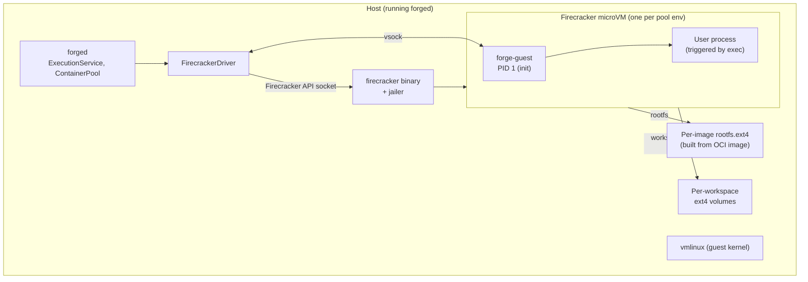
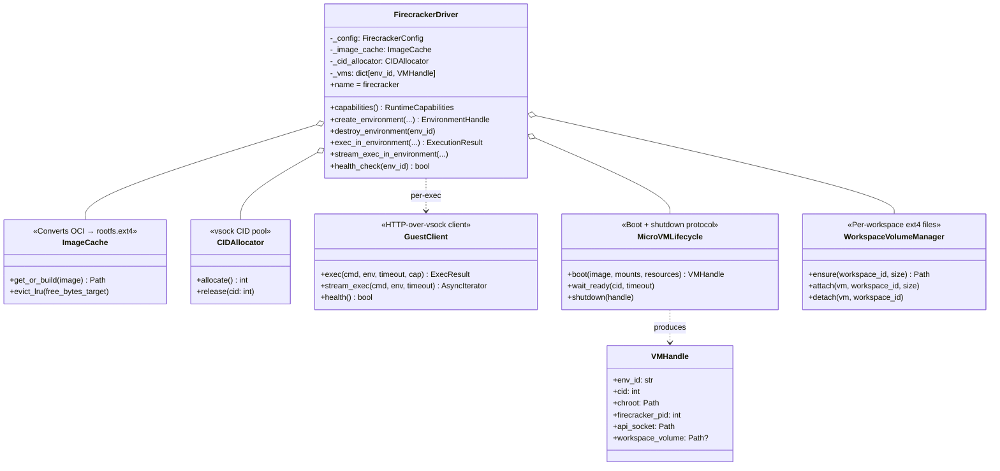
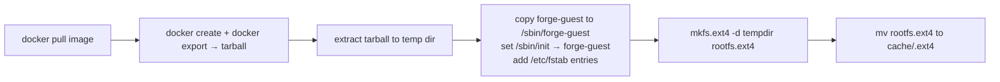

# V2 driver design — Firecracker

**Goal:** implement `FirecrackerDriver` that satisfies the existing `RuntimeDriver` protocol without any changes above Layer 3 of the [architecture](../architecture/overview.md#runtime-layers-and-their-contracts).

**Success criterion:** the existing 127-test suite runs green with the driver swapped from `DockerDriver` to `FirecrackerDriver` (integration tests pointed at a Firecracker daemon on the host). Nothing in `services/`, `pool/container_pool.py`, `client/`, or `langchain/` changes.

This doc is the technical companion to [plan.md](plan.md).

---

## The whole thing in one picture



**Read the diagram top-to-bottom, then vertical bars:**

- `forged` still calls `FirecrackerDriver.exec_in_environment(env_id, cmd, workspace_id, env, ...)` — unchanged signature.
- The driver talks to the Firecracker binary over its Unix API socket to create/start/stop VMs.
- Inside each microVM runs `forge-guest`, a small binary (or a Python script — see [Guest agent](#guest-agent-forge-guest)) that is PID 1 and speaks HTTP over vsock.
- User commands run under `forge-guest`, which handles cwd, env, and streaming stdout/stderr back to the driver.

---

## Interface parity check

The whole point is that `FirecrackerDriver` implements the same protocol as `DockerDriver`:

```python
class RuntimeDriver(Protocol):
    name: str
    def capabilities(self) -> RuntimeCapabilities: ...
    async def create_environment(self, *, image, mounts, resources) -> EnvironmentHandle: ...
    async def destroy_environment(self, environment_id: str) -> None: ...
    async def exec_in_environment(
        self, environment_id, command, *,
        workspace_id, env, timeout_seconds, max_output_bytes,
    ) -> ExecutionResult: ...
    def stream_exec_in_environment(...) -> AsyncIterator[LogEvent]: ...
    async def health_check(self, environment_id: str) -> bool: ...
```

Mapping to Firecracker mechanics:

| Method | Firecracker mechanic |
|---|---|
| `create_environment(image, mounts, resources)` | Convert OCI image → rootfs.ext4 (cached); allocate CID; start `firecracker` process; configure kernel + rootfs + network + vsock via API; attach workspace volume; boot; wait for `forge-guest` to advertise ready over vsock |
| `destroy_environment(env_id)` | Send `SIGTERM` to firecracker process; unmount workspace volume; free CID; delete jailer chroot |
| `exec_in_environment(env_id, cmd, workspace_id, env, timeout, max_output_bytes)` | Open vsock connection to `forge-guest`; POST `/exec` with cmd + env + workspace path; read buffered stdout/stderr up to cap; return `ExecutionResult` |
| `stream_exec_in_environment` | Same, but `POST /exec/stream` returning chunked events |
| `health_check(env_id)` | GET `/health` over vsock; expect `200 {"status":"ok"}` |
| `capabilities()` | Return `RuntimeCapabilities(isolation="microvm", snapshots=True, pause_resume=True, network_control=True, resource_limits=True, hot_attach_volume=True, supports_streaming_logs=True)` |

**Nothing above the driver notices the swap.** `_PooledSession` still wraps `(driver, env_handle, workspace_id, image)`. `ContainerPool` still tracks `_SubPool` per image, still enforces min_idle / max_size / TTL. `ExecutionService` still calls `pool.session(workspace_id, image)` → `sess.exec(...)`.

---

## What's new inside the driver

The Docker driver was small (~470 lines) because Docker did all the heavy lifting. Firecracker is not Docker — we have to do more work in-driver.



Six moving parts:

1. **`ImageCache`** — OCI image → rootfs.ext4 conversion, cached on disk.
2. **`CIDAllocator`** — vsock context IDs are integers; the pool of them is finite.
3. **`WorkspaceVolumeManager`** — per-workspace ext4 files, attached per boot as the workspace disk.
4. **`MicroVMLifecycle`** — the actual `firecracker` process supervision.
5. **`GuestClient`** — HTTP-over-vsock client the driver uses to talk to `forge-guest`.
6. **`forge-guest`** — the in-VM daemon. See [Guest agent](#guest-agent-forge-guest).

Each has a small, testable surface. `FirecrackerDriver` itself is thin glue.

---

## Startup path (create_environment)

```mermaid
sequenceDiagram
    autonumber
    participant Pool as ContainerPool
    participant Drv as FirecrackerDriver
    participant IC as ImageCache
    participant WM as WorkspaceVolMgr
    participant Life as MicroVMLifecycle
    participant Jailer as jailer + firecracker
    participant Guest as forge-guest (in VM)

    Pool->>Drv: create_environment(image, mounts, resources)
    Drv->>IC: get_or_build(image)
    IC->>IC: check cache
    alt cache miss
        IC->>IC: docker pull + export → tar<br/>tar → ext4 loop mount → rootfs.ext4
    end
    IC-->>Drv: rootfs_path

    Drv->>WM: ensure workspaces volume attached to VM
    Note over Drv: For MVP-of-V2:<br/>one shared workspaces disk<br/>(per-workspace volume is F3)
    WM-->>Drv: workspace_disk_path

    Drv->>Drv: cid = cid_allocator.allocate()
    Drv->>Life: boot(rootfs, kernel, workspace_disk, cid, resources)
    Life->>Jailer: exec firecracker --api-sock ... --config ...
    Life->>Jailer: PUT /machine-config (cpu, mem)
    Life->>Jailer: PUT /boot-source (kernel + boot args)
    Life->>Jailer: PUT /drives/rootfs
    Life->>Jailer: PUT /drives/workspace
    Life->>Jailer: PUT /vsock (cid)
    Life->>Jailer: PUT /network-interfaces (tap)
    Life->>Jailer: PUT /actions InstanceStart
    Jailer->>Guest: kernel boots; init=/sbin/forge-guest
    Guest->>Guest: bring up vsock listener on port 8080

    Drv->>Guest: GET /health (over vsock CID:8080)
    Guest-->>Drv: 200
    Drv-->>Pool: EnvironmentHandle(id=cid-uuid, image, driver=firecracker)
```

Rough timings, targets:
- Cache-hit rootfs read: <10 ms.
- Firecracker boot from `PUT /actions` to kernel PID 1: 100-150 ms (Firecracker's published number).
- `forge-guest` starts + vsock listener: ~50 ms.
- Total warm-image cold-start budget: **~250 ms**, matching or beating our current Docker cold-start.

---

## Guest agent (`forge-guest`)

**Runs as PID 1 inside every microVM.** Speaks HTTP over vsock. E2B calls their equivalent `envd`; we call ours `forge-guest`.

### Contract

```
GET  /health                              → 200 {"status":"ok"}
POST /exec                                → run one command, return buffered result
POST /exec/stream                         → run one command, stream chunks
POST /mount                               → mount a block device to a path (V2+)
GET  /files/{path}                        → read a file (fallback API; usually
                                             we prefer host-side mount)
PUT  /files/{path}                        → write a file
POST /shutdown                            → clean shutdown
```

### `POST /exec` request/response

```json
// Request:
{
  "command": ["python", "main.py"],
  "env": {"FOO": "bar"},
  "workspace_id": "ws_abc",
  "timeout_seconds": 60,
  "max_output_bytes": 100000
}
```

```json
// Response:
{
  "output": "hi\n",
  "exit_code": 0,
  "truncated": false,
  "duration_ms": 42
}
```

Same shape as `ExecutionResult` on the Python side. Zero mapping code.

### Internals

`forge-guest` does what `forge-run` does today, but from the inside:

```
POST /exec  → parse args
            → export env
            → cd to /workspace  (the mounted workspace volume)
            → fork+exec  cmd
            → capture stdout+stderr with size cap
            → wait for exit or timeout
            → return JSON response
```

### Implementation language

**Rust or Go.** Rust matches the Firecracker ecosystem (jailer, snapfaas, prior art) but Go compiles faster and has a saner HTTP-over-vsock story. Straw poll: Go for MVP, revisit if we need memory savings.

Size target: single static binary, <10 MB, runs on `busybox` rootfs. No dependencies at runtime.

### Init responsibilities

Because `forge-guest` is PID 1:

1. Mount `/proc`, `/sys`, `/dev`.
2. Bring up vsock listener.
3. Mount workspace volume (block device from Firecracker `PUT /drives/workspace`).
4. Reap zombies (`waitpid` loop in a thread).
5. Handle `SIGTERM` for clean shutdown.

None of this is exotic — every microVM sandbox project does this. Firecracker's `firectl` docs and E2B's `envd` are references.

---

## Image conversion — OCI to rootfs.ext4

The one big new piece of infrastructure. `docker pull python:3.14-slim` gives us layers; Firecracker needs a single ext4 image with a working `/sbin/init` (our `forge-guest`).

Approach (well-trodden, borrowed from `firectl` and `weaveworks/ignite`):



Cache key is the OCI digest of the image (not the tag) so cache invalidation is automatic. Cache is on-disk, LRU-evicted when free space drops below threshold.

**Alternative: OCI runtime bundle → shim → block device.** More flexible, more moving parts. Skip for MVP-of-V2.

Runtime cost of a cold conversion: 15-60 seconds per image. Users won't hit this often because we cache per-digest — the daemon pre-warms rootfs images at start for the images in `warm_images`.

---

## Workspace filesystem

**MVP-of-V2 (safer intermediate step):**

- Same as today: one shared `workspaces/` disk attached to every microVM.
- `forge-guest` mounts it at `/workspaces` and `cd`s to `/workspaces/<workspace_id>` per exec.
- **Wins:** identical to today, no per-workspace volume mgmt. **Loses:** doesn't fix the peer-workspace-visibility issue — a compromised agent can still `ls /workspaces`.

**Full V2 (recommended):**

- Per-workspace ext4 volume file. `WorkspaceVolumeManager.ensure(workspace_id, size_gb)` creates a sparse ext4 file if it doesn't exist.
- On `create_environment`, we know the workspace at boot time (because sessions bind before hand-off). Only that one volume is attached, mounted by `forge-guest` at `/workspace`. Peer workspaces are literally not attached — kernel can't reach them.
- **Wins:** real per-tenant isolation, disk quotas via file size.
- **Loses:** the workspace-to-container binding must happen at VM boot time, which changes the pool model — a microVM is bound to one workspace for life. This is more like E2B's model (one sandbox = one workspace).

**Which one for MVP-of-V2:** the shared-mount version. It preserves the pool-based "one env serves many workspaces" model of the Docker driver. Full per-workspace-volume isolation is a follow-up branch (F5) that adopts the E2B model and drops the multi-workspace reuse.

See [plan.md](plan.md#branch-plan) for how these are staged.

---

## Networking

Two modes exposed via `RuntimeCapabilities.network_control`:

1. **Isolated** (default): no external network. `forge-guest`'s vsock is the only channel. Egress = zero.
2. **Bridged**: TAP device + iptables NAT + optional egress allowlist. Common for agents that need `pip install`.

Firecracker's networking is per-VM TAP devices attached via `PUT /network-interfaces`. The driver creates the TAP, sets up NAT rules, tears them down on `destroy_environment`.

**Egress allowlisting** is a nice future feature — set `iptables` rules per-microVM based on the workspace's `Policy` (see V2 plan work-item **T2**). Runloop's `AI Gateway` pattern is worth stealing here: instead of allowlisting domains, run an in-guest proxy that only allows known LLM providers.

---

## Snapshots

Firecracker's native snapshots are one of the reasons we're going V2. They give us:

- **Sub-second cold-start** by restoring from a warm snapshot instead of booting fresh.
- **Fork / branch** — start N microVMs from the same snapshot, each with copy-on-write divergence.
- **Pause / resume** — save state on idle, resume on request. E2B's default lifecycle.

Two snapshot kinds:

1. **Base snapshot per image**: created once when we first pull an image. Booting from this is ~50 ms vs ~150 ms fresh boot. `capabilities().snapshots = True`.
2. **Workspace snapshot on-demand**: user calls `ws.snapshots.create()`; driver pauses microVM, copies rootfs + memory snapshot to storage. Later `restore()` boots from it.

For MVP-of-V2, only base-image snapshots. Per-workspace memory snapshots are a follow-up.

---

## Resource limits

`ResourceLimits` maps cleanly to Firecracker:

| Field | Firecracker config |
|---|---|
| `cpu: float` (cores) | `PUT /machine-config {"vcpu_count": ceil(cpu)}` |
| `memory: str` ("1Gi", "512Mi") | `PUT /machine-config {"mem_size_mib": ...}` |
| `disk: str` ("2Gi") | ext4 volume size at `WorkspaceVolumeManager.ensure()` |

Additional per-VM knobs Firecracker exposes:

- **rate_limiter** on drives — throttle IOPS.
- **rate_limiter** on network interfaces — throttle bandwidth.
- **cpu_template** — mask specific CPU features (SGX, RDRAND).

Wire these into `ResourceLimits` in V2. The MVP `ResourceLimits(cpu, memory, disk)` is a subset of what Firecracker natively supports.

---

## Failure modes and how they map

| Failure | Firecracker signal | Driver action |
|---|---|---|
| `firecracker` process crashes | Process exits non-zero | `health_check` fails; pool discards + creates new env |
| `forge-guest` hangs (kernel alive) | `/health` GET times out | Health check false; destroy VM; retry |
| vsock full / disconnected | `ConnectionRefused` on new sockets | Same as above |
| VM boot times out (rootfs corrupt) | `firecracker` doesn't respond within N seconds | `create_environment` raises `ContainerStartError`; pool retries with a fresh cache entry |
| OOM inside VM | Kernel OOM-kill; `forge-guest` may or may not survive | `health_check` fails; destroy + recreate |
| jailer chroot leak | Firecracker crash leaves chroot mounted | Startup sweep on daemon boot cleans stale chroots |

None of these change the pool logic. `ContainerPool` treats "env failed health check" the same way regardless of driver — that's the whole point of the abstraction.

---

## Deployment surface

Firecracker needs:

- **KVM** on the host (Linux only, `/dev/kvm` accessible).
- **`firecracker` binary** on `PATH`.
- **`jailer` binary** for chroot isolation.
- **Kernel image** (`vmlinux.bin`) — bake one at build time, distribute with the daemon.
- **`forge-guest` binary** — bake at build time, distribute alongside the kernel.
- **CAP_NET_ADMIN + CAP_SYS_ADMIN** on the daemon (for TAP devices + jailer mounts). Fine on VMs / bare metal.

**What breaks on macOS:** everything. Firecracker is Linux-only. We keep the Docker driver as the macOS dev path (like E2B does — `e2b_code_interpreter` on macOS runs against E2B's cloud, not local Firecracker).

**Multi-arch:** `arm64` Firecracker works but needs an arm64 `vmlinux.bin` + arm64 `forge-guest`. Distribute both.

---

## Testing strategy

The test suite lives to prove one thing: **the driver is drop-in.**

### Reuse the existing integration tests

`tests/integration/test_docker_driver.py` has 12 tests. Copy them to `tests/integration/test_firecracker_driver.py`. Only change: fixture uses `FirecrackerDriver` instead of `DockerDriver`.

Every test that's currently green with Docker must be green with Firecracker. That's the acceptance test for V2.

### New tests specific to Firecracker

- **Boot cold-start time under N seconds** (regression: prevent our boot budget from creeping past 250 ms).
- **CID allocator doesn't leak** across N test runs.
- **Image cache LRU eviction** hits target free space.
- **Workspace volume attach/detach** roundtrip.
- **Snapshot base image** boots ~2× faster than fresh.

### Chaos tests (V2+)

- Kill `firecracker` process mid-exec — driver should surface as clean error.
- Kill `forge-guest` — health check must detect within one interval.
- Fill workspace volume — write must fail with clear error.

Run in CI via a Linux runner with KVM. GitHub Actions bare Ubuntu runners have KVM. Test the whole stack there.

---

## Open questions / things to decide during implementation

1. **`forge-guest` in Rust or Go?** Straw poll Go for MVP, revisit if RAM matters. Rust prior art (`envd`) is compelling.
2. **How to distribute `forge-guest` + kernel?** Baked into the Python wheel, or downloaded on first daemon start? First-download is smaller but complicates offline installs. Straw poll: baked at ~5 MB total.
3. **Snapshot on idle** — do it at driver level or pool level? If at pool level, it's a new capability the pool advertises. If at driver level, snapshot state is opaque to the pool. Straw poll: driver level. Pool just sees "still alive" via `health_check`.
4. **Firecracker vs Cloud Hypervisor** — CH has better device support (virtio-fs, better networking). We're picking Firecracker for MVP because more prior art and smaller attack surface. Could add a `CloudHypervisorDriver` later.
5. **Per-workspace vs shared workspace disk** — start shared, migrate to per-workspace as F5. See [plan.md](plan.md).

---

## Related reading

- [plan.md](plan.md) — the V2 branch plan; this doc is its "how" companion.
- [sdk-parity.md](sdk-parity.md) — what to learn from Modal, E2B, Daytona, Runloop, Fly.
- [../architecture/pool-and-runtime-session.md](../architecture/pool-and-runtime-session.md) — the abstraction we're slotting Firecracker into.
- [Firecracker docs](https://github.com/firecracker-microvm/firecracker) — API reference.
- [E2B infra](https://github.com/e2b-dev/infra) — the closest OSS prior art for this exact stack.
